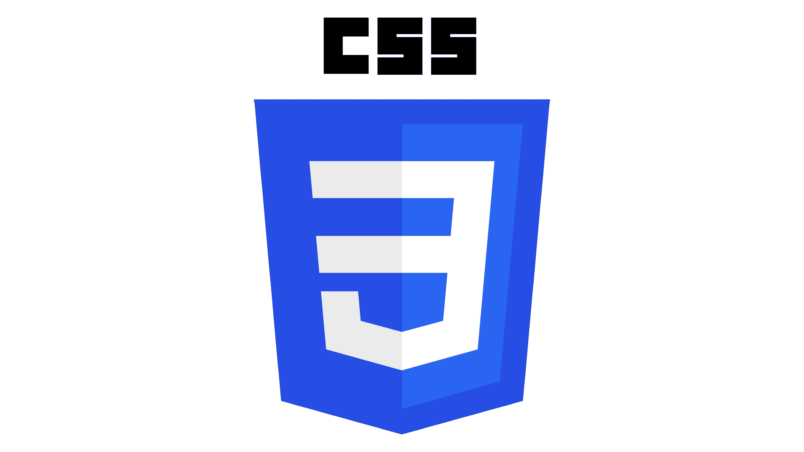
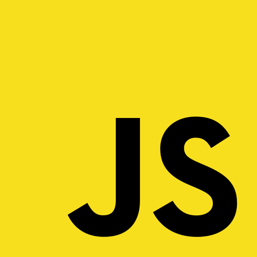

# Hi! My name is Viktoriia!

   
 I am a 25-year-old developer with one year of experience.
Focused on creating user-friendly and responsive applications, writing clean, efficient and easy-to-maintain code. I always strive to learn current trends and best practices.

### 🤝 Soft skills:

- responsibility,
- adaptability,
- determination,
- communication.

---

### 💻 My stack:

